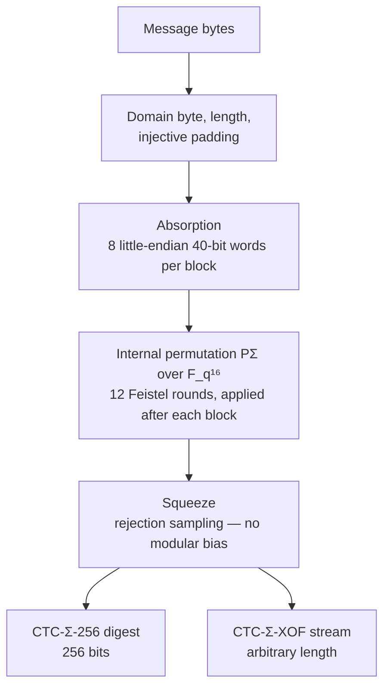
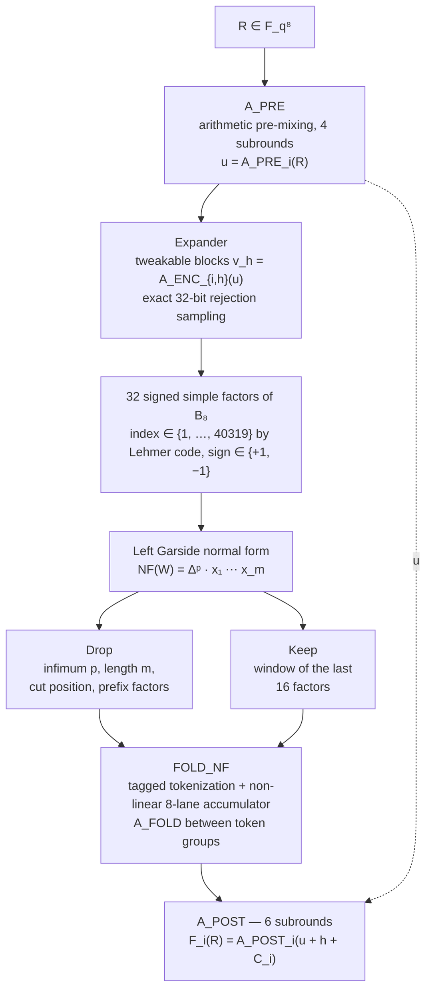
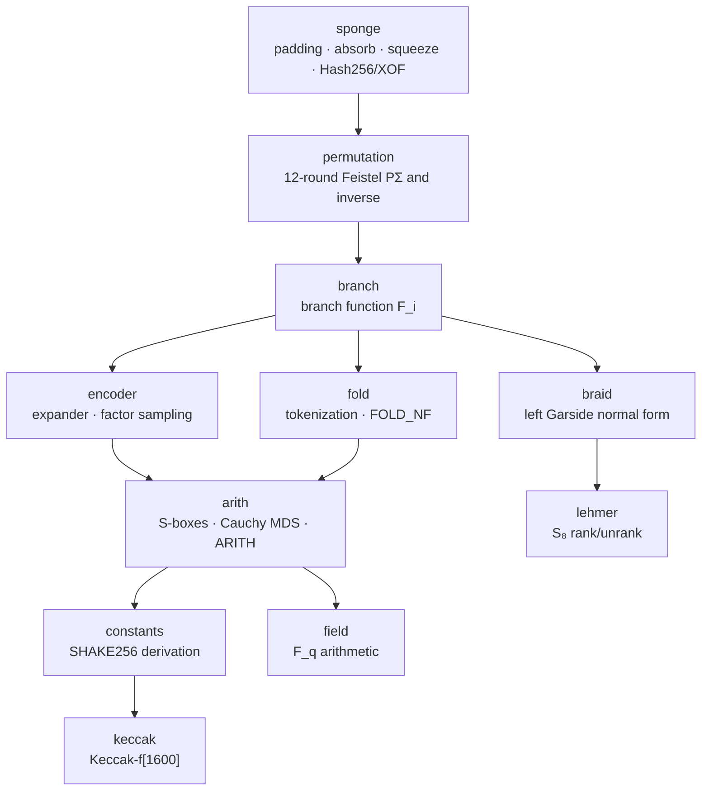

# CTC-Σ (CTC-Sigma)

<div align="center">

**An experimental hash function and XOF candidate built from a Feistel permutation<br>over a prime field and the left Garside normal form of the braid group B₈.**

Reference implementation in C11 with a Python validation suite.

[](https://github.com/igors93/CTC-Sigma/actions/workflows/ci.yml)


</div>

> ⚠️ **Experimental status.** CTC-Σ is a research candidate under active
> cryptanalysis. It must **not** be used to protect real data. No security
> property has been proven; every figure in this document is a design goal,
> not a claim.

---

## Table of contents

- [Overview](#overview)
- [Design at a glance](#design-at-a-glance)
- [How the construction works](#how-the-construction-works)
  - [Sponge mode](#sponge-mode)
  - [The permutation PΣ](#the-permutation-pσ)
  - [The branch function F_i](#the-branch-function-f_i)
  - [Arithmetic layer](#arithmetic-layer)
  - [Braid layer and Garside normalization](#braid-layer-and-garside-normalization)
  - [Public constants](#public-constants)
- [Security goals and non-claims](#security-goals-and-non-claims)
- [Implementation architecture](#implementation-architecture)
- [Repository layout](#repository-layout)
- [Building](#building)
- [Testing](#testing)
- [Known-answer vectors](#known-answer-vectors)
- [Project status and roadmap](#project-status-and-roadmap)
- [Design rules](#design-rules)

---

## Overview

CTC-Σ is an experimental symmetric primitive that defines two unkeyed
functions:

- **CTC-Σ-256** — a hash function with a fixed 256-bit output;
- **CTC-Σ-XOF** — an extendable-output function of arbitrary length.

Its distinguishing idea is to combine **two unrelated mathematical
structures** inside one permutation:

1. an **exact arithmetic layer** over the prime field
   `F_q`, `q = 2⁶¹ − 1` (Dickson polynomials, field inversion, an MDS
   Cauchy matrix), and
2. a **combinatorial layer** based on the **left Garside normal form** of
   the braid group `B₈`, whose 8! = 40320 simple elements are indexed by
   the Lehmer code of permutations of eight symbols.

The braid layer is *not* presented as a one-way function and the design does
not rely on any braid-based hardness assumption. It is used as a structured,
highly non-linear mixing component whose statistical and differential
behavior is meant to be measured, not assumed. Resistance is expected to
emerge from the global behavior of the permutation and must be established
by public cryptanalysis.

The construction was specified so that independent implementations, frozen
test vectors, reduced instances, and knockout experiments are all part of
the scientific plan from day one.

## Design at a glance

| Parameter | Value | Role |
|---|---|---|
| `q` | `2⁶¹ − 1` (prime) | Field modulus |
| State | 16 lanes over `F_q` (≈ 976 bits) | Sponge state |
| Feistel halves | 2 × 8 lanes | `L`, `R` |
| Rounds `R_F` | 12 | Feistel rounds of PΣ |
| `t` | 32 | Signed simple factors generated per branch call |
| `c_G` | 16 | Retained window of the normal form |
| Rate | 320 bits (8 × 40-bit words) | Absorbing/squeezing region |
| Capacity | `q⁸` ≈ 2⁴⁸⁸ states | Hidden region |
| Output | 256 bits (hash) / arbitrary (XOF) | |

The round count, factor count, and window size are conservative laboratory
parameters. They are meant to be attacked in reduced form, not advertised as
security minima.

## How the construction works



### Sponge mode

The outer construction is a sponge over the permutation PΣ. The state lives
in `F_q¹⁶`; input is added only to the first eight lanes (the rate) and
output is read only from those lanes. Hash256, XOF, and internal test
vectors use distinct initialization vectors and distinct domain bytes
(`0x01`, `0x02`, `0x7F`), so their input encodings can never collide. The
encoding appends the message length, the domain byte, and two markers,
making the padding injective and decodable.

Both directions of the byte/field boundary use **exact rejection sampling**:
a squeeze block is emitted only when all eight rate lanes are below
`⌊q/2⁴⁰⌋·2⁴⁰`, which removes the modular bias that a plain `mod 2⁴⁰`
truncation would introduce. The expected rejection rate is below `2⁻²¹` per
lane.

### The permutation PΣ

PΣ is a **balanced Feistel network** with 12 rounds over two halves of
eight field elements:

```text
T_i      = F_i(R_i)
L_(i+1)  = R_i
R_(i+1)  = L_i + T_i   (mod q)
```

Because a Feistel round is invertible for *any* deterministic branch
function, the branch function is free to contain non-invertible steps —
this is what allows Garside normalization, partitioning, and compression to
live inside a provably bijective permutation. The inverse permutation is
implemented and tested, which is a structural requirement for a coherent
sponge argument.

### The branch function F_i

Each round's branch function maps eight lanes to eight lanes through six
stages:



Nothing from the normal form is silently discarded: the infimum, canonical
length, cut position, prefix factors, and window factors are all serialized
as `(tag, value)` tokens (`tag·2⁴⁸ + value`, every token fits in one field
element) and absorbed by the FOLD_NF accumulator. Length fields and an end
marker prevent boundary-collision ambiguities in the token stream.

### Arithmetic layer

The arithmetic permutation `ARITH(label, round, x, ρ)` applies ρ subrounds
of:

1. **constant addition** — per-lane, domain-separated constants;
2. **S-box** — `S(x) = A + B·Inv(D_d(x + C)) mod q`, where `D_d` is a
   Dickson polynomial of degree 23 or 47 (both permutations of `F_q`,
   alternating by subround parity) and `Inv` is field inversion with
   `Inv(0) = 0`; each step is bijective, so the S-box is a permutation;
3. **diffusion** — multiplication by an 8×8 **Cauchy matrix**
   `M[i][j] = (aᵢ + bⱼ)⁻¹`, which is MDS with maximal branch number 9.

All arithmetic is exact; no floating point exists anywhere in the code.

### Braid layer and Garside normalization

The 32 signed factors form the word `W = Simple(r₁)^ε₁ ⋯ Simple(r₃₂)^ε₃₂`
in `B₈`. The implementation computes its **left Garside normal form**
`NF(W) = Δᵖ · x₁ ⋯ x_m` over permutation braids:

- a simple element is stored as a permutation `map[start] = end`; the
  Garside element Δ is the order-reversing permutation (Lehmer rank 40319);
- a negative factor is rewritten as `x⁻¹ = Δ⁻¹ · τ(∂(x))` with the right
  complement `∂(x) = x⁻¹Δ` and the flip automorphism `τ(x) = Δ⁻¹xΔ`; each
  `Δ⁻¹` is pulled to the front, applying τ to the factors it crosses;
- adjacent factors are made **left-weighted** by transferring
  `t = ∂(a) ∧ b` (the prefix-lattice meet, computed by greedy extraction of
  common initial generators) until a fixed point is reached;
- Δ factors accumulate at the front and are absorbed into the infimum;
  identity factors accumulate at the back and are dropped.

The normalizer sits behind a function-pointer interface
(`ctc_braid_normalizer_fn`), so alternative implementations can be injected
without touching any other module — this is how the cross-implementation
tests work (see [Testing](#testing)). Every injected result is validated before
FOLD: stored factors must be proper Lehmer ranks 1..40318 and adjacent pairs
must be left-weighted. This validates canonical representation, not semantic
equivalence to the input word, so injected normalizers remain trusted
components.

### Public constants

Constants outside the encoder preserve the v0.1 derivation exactly:

```text
Seed(label, a, b)  = "CTC-SIGMA-v0.1|" ‖ label ‖ LE32(a) ‖ LE32(b)
Const(label, a, b) = IntegerLE(SHAKE256(Seed, 16 bytes)) mod q
```

The v0.2 encoder uses a separate, collision-free tweak domain:

```text
SeedEnc(c,i,h,s,j) = "CTC-SIGMA-v0.2|A_ENC-TWEAK|"
                     ‖ LEN8(c) ‖ c ‖ LE32(i) ‖ LE32(h)
                     ‖ LE32(s) ‖ LE32(j)
ConstEnc(c,i,h,s,j) = IntegerLE(SHAKE256(SeedEnc, 16 bytes)) mod q
```

Here `c` is one of `RC`, `SBOX-A`, `SBOX-B`, or `SBOX-C`; `i` is the
Feistel round, `h` the encoder block, `s` the subround, and `j` the lane.
`SBOX-B` is forced non-zero. The counter is never added or XORed into the
data state: it selects the constants of `A_ENC_{i,h}`. SHAKE256 is only a
public, reproducible number generator and is not a secret dependency.

## Security goals and non-claims

| Property | Design goal (CTC-Σ-256) | Status |
|---|---|---|
| Collision resistance | up to 2¹²⁸ generic operations | goal, not proven |
| Preimage resistance | up to 2²⁵⁶ generic operations | goal, not proven |
| Second preimage | up to 2²⁵⁶ for unstructured messages | goal, not proven |
| Output indistinguishability | no practical bias in test batteries | to be tested |
| Structural security | no differentials/invariants/decompositions below the goals | to be tested |

What **is** structurally guaranteed: PΣ is a permutation; the S-boxes are
permutations; the MDS layer has maximal branch number; sampling of words and
factors is bias-free by rejection; the token serialization is
syntactically unambiguous; domains are separated.

What is **not** claimed: that combining two mathematical structures makes
the composition harder to attack; that Garside normalization is one-way;
that 12 rounds are sufficient; that state size alone implies any security
level. These are open questions in the specification's research plan.

## Implementation architecture

One-way dependency structure — lower modules never depend on higher ones:



| Module | Responsibility |
|---|---|
| `field` | Canonical arithmetic over `F_q` (add, sub, mul, pow, inversion, Dickson) |
| `keccak` | Self-contained Keccak-f[1600] / SHAKE256 for constant derivation |
| `constants` | Legacy constants plus the v0.2 tweakable `A_ENC` constant domain |
| `arith` | S-boxes, Cauchy MDS, generic `ARITH`, and tweakable `A_ENC_{i,h}` with inverses |
| `lehmer` | Canonical rank/unrank of `S₈` permutations (Lehmer code) |
| `braid` | Simple factors, left Garside normal form, canonical-form validation, injectable API |
| `encoder` | Tweakable block generation and bias-free signed-factor sampling |
| `fold` | Canonical tokenization of the normal form and `FOLD_NF` accumulator |
| `branch` | The branch function `F_i` (A_PRE → encoder → NF → FOLD → A_POST) |
| `permutation` | 12-round Feistel permutation PΣ and its inverse |
| `sponge` | IVs, injective padding, absorption, rejection-based squeeze, Hash256/XOF |

Every fallible function returns a `ctc_status_t`; cryptographic code never
terminates the process. Rejection loops carry defensive iteration limits.
Incomplete or malformed inputs (out-of-range factors, invalid signs,
oversized words) are rejected with explicit statuses.

Validation follows the specification's "two independent implementations"
requirement: the C normalizer (meet-based) is cross-checked against an
independent Python reference (atom-transfer based,
`test/python/garside_reference.py`) both at the unit level and through the
full hash pipeline.

## Repository layout

```text
.
├── .github/workflows/        Continuous integration (build, tests, sanitizers)
├── cmake/                    Reusable CMake configuration
├── docs/                     Architecture, status, and spec traceability
├── include/ctc_sigma/        Public C API (one header per module)
├── src/                      C11 cryptographic core
│   └── internal/             Private implementation headers
├── test/
│   ├── python/               pytest suite (ctypes bindings to the C library)
│   │   ├── unit/             Per-module tests
│   │   ├── integration/      Default paths, cross-implementation, KAT
│   │   └── garside_reference.py   Independent Garside implementation
│   └── vectors/              Frozen known-answer vectors
├── tools/                    Development executables (constant dump)
└── scripts/                  Build helper and KAT generator
```

## Building

Requirements: CMake ≥ 3.20 and a C11 compiler with `unsigned __int128`
support (GCC or Clang).

```bash
cmake -S . -B build -DCMAKE_BUILD_TYPE=Release
cmake --build build --parallel
```

Artifacts:

| Artifact | Description |
|---|---|
| `build/libctc_sigma.a` | Static library |
| `build/libctc_sigma.so` | Shared library (used by the Python suite) |
| `build/ctc_dump_constants` | Public-constant preview tool |

## Testing

```bash
python -m pip install pytest
pytest                # full suite
pytest -m "not slow"  # fast subset
```

The suite covers four layers of assurance:

1. **Unit correctness** — field axioms, Dickson permutation property,
   ARITH round-trips, exhaustive Lehmer rank/unrank over all 40320 ranks,
   encoder rejection rules, token structure, padding boundaries.
2. **Independent cross-check** — the C Garside normalizer must agree with
   the Python reference on random signed words; outputs are verified to be
   left-weighted and to project to the correct `S₈` permutation.
3. **Pipeline agreement** — Hash256/XOF computed with the injected Python
   normalizer must equal the default C path byte for byte.
4. **Frozen vectors** — hashes, XOF, permutation, encoder blocks, factor
   streams, and the encoder constant manifest are compared against the v0.2
   files in `test/vectors/`.
5. **Structural regression** — direct tests verify that the v0.1 identity
   `B_i(u + e₀, h) = B_i(u, h + 1)` is no longer present.

## Known-answer vectors

`test/vectors/ctc_sigma_v02_kat.json` freezes:

- Hash256 digests for message lengths 0, 1, 39, 40, 41, 80, 1024;
- XOF outputs of 1, 31, 32, 40, 41, 64, 1000 bytes for the empty message
  and a fixed 41-byte message;
- input/output pairs of the permutation PΣ;
- raw `A_ENC_{i,h}` blocks for rounds 0, 3, 7, 11 and blocks 0..4;
- one complete 32-factor encoder stream and its block count.

`ctc_sigma_v02_encoder_constants.json` freezes the representative public
constant manifest and the adjacent `.sha256` file authenticates its exact
serialization. The old `ctc_sigma_v01_kat.json` remains only as a historical
snapshot and is intentionally not used by the v0.2 tests.

Messages follow `byte[i] = i mod 256`. Regenerate v0.2 files only after an
intentional, documented specification change:

```bash
python scripts/generate_kat.py
```

## Project status and roadmap

All modules of the revised v0.2 implementation are present and tested. The
confirmed encoder counter/input alias has been removed by making the block
index a tweak of all `A_ENC` subround constants, and injected normal forms are
validated before FOLD. See
[docs/IMPLEMENTATION_STATUS.md](docs/IMPLEMENTATION_STATUS.md) for the
per-module table and
[docs/SPEC_TRACEABILITY.md](docs/SPEC_TRACEABILITY.md) for the
specification-to-source mapping.

Next stages follow the specification's scientific plan:

1. **Phase 0Σ — correctness and reproducibility**: large randomized
   invariant sweeps, rejection-rate telemetry, published environment
   hashes.
2. **Phase 1Σ — diffusion and statistics**: avalanche and SAC measurements,
   factor/infimum/length distributions, output bias batteries.
3. **Phase 2Σ — reduced-round cryptanalysis**: differential/linear
   analysis, invariant subspaces, slide/meet-in-the-middle/rebound attacks,
   algebraic modeling, the fully enumerable Toy-13 instance
   (`q = 2¹³ − 1`, `B₄`), and the knockout experiments that must show each
   layer's measurable contribution.

Performance work (e.g., caching SHAKE256-derived constants) is deliberately
deferred: this milestone favors reference clarity over speed.

## Design rules

- C source code, identifiers, and comments are in English.
- Modules expose narrow public interfaces; no cross-layer dependencies.
- Errors propagate through `ctc_status_t` — no `abort()`, no `exit()`.
- No floating-point arithmetic anywhere.
- External words are little-endian; field elements are canonical
  (`0 ≤ x < q`) 64-bit integers.
- The permutation-braid convention is documented in `src/braid.c` and
  mirrored by the Python reference.
- Missing functionality returns an explicit status instead of silently
  substituting a non-equivalent computation.
